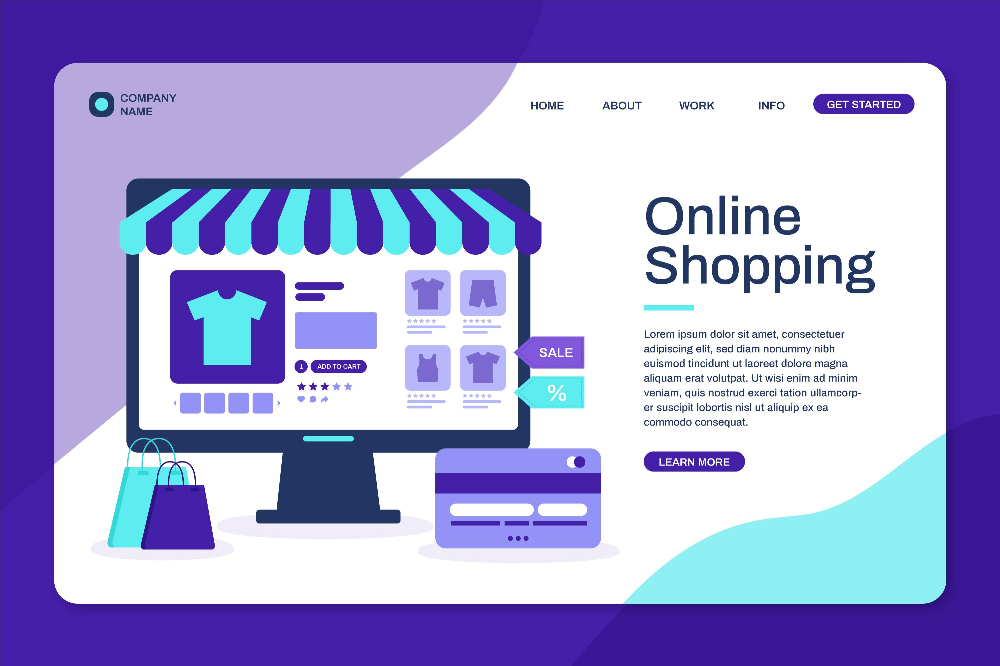

# Online Shop Documentation

Welcome to the Online Shop documentation. This guide provides all the necessary information to get started with our online shopping platform, including setup, launch instructions, and key features.

## Table of Contents

1. [Introduction](#introduction)
2. [Features](#features)
3. [System Requirements](#system-requirements)
4. [Installation Guide](#installation-guide)
5. [Launching the Application](#launching-the-application)
6. [Navigating the Online Shop](#navigating-the-online-shop)
7. [Troubleshooting](#troubleshooting)
8. [FAQ](#faq)
9. [Contact Information](#contact-information)

## Introduction

Briefly describe your online shop, its purpose, and what users can expect from it.

## Features

List down the key features of your online shop. For example:

- User authentication and authorization
- Product listing
- Shopping cart functionality
- Order management
- Payment integration

## System Requirements

Specify the hardware and software requirements for running your online shop. For example:

- Operating System: Windows 10, macOS Big Sur, or later
- Web Browser: Latest versions of Chrome, Firefox, Safari, or Edge
- Internet Connection: Broadband recommended

## Installation Guide

Provide step-by-step instructions on how to install and set up your online shop. Include any necessary commands, scripts, or download links.

## Launching the Application

Explain how to launch your online shop. For example:

1. Navigate to the project directory in your terminal.
2. Run `npm start` to launch the application.
3. Open your web browser and go to `http://localhost:3000` to access the online shop.

## Navigating the Online Shop

Provide a brief guide on how to use the online shop. Include screenshots to illustrate the process. You can add images to your markdown file like this:

[TRY-IT](https://github.com/)

# MarkDown
